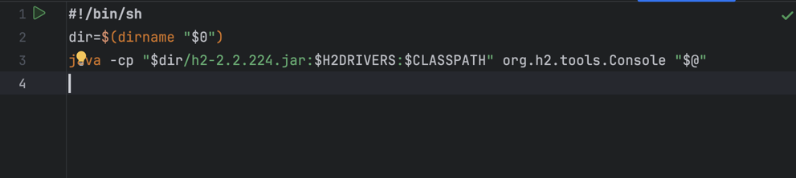
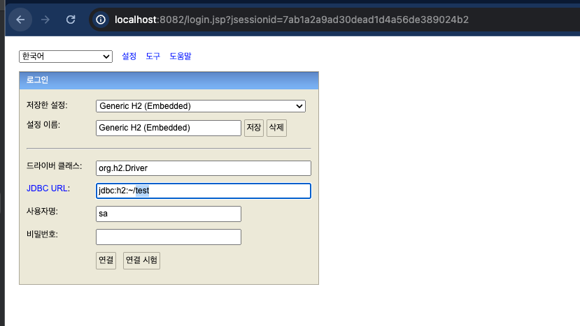
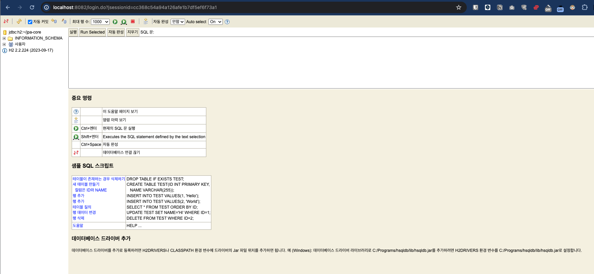

## 자바 ORM 표준 JPA 프로그래밍 - 기본편
https://www.inflearn.com/course/lecture?courseSlug=ORM-JPA-Basic&unitId=21684&tab=curriculum

## h2 DB 다운로드 링크
- h2 DB는 자바로 작성된 경량의 데이터베이스이다.
https://www.h2database.com/html/download.html
### 주의사항:
- h2 DB 버전과 h2 DB 드라이버 버전이 일치해야 한다.


## h2 DB 실행하기 

1) 터미널에서 실행
```terminal
cd ~/h2-db/h2/bin 
./h2.sh 
``` 
2) editor 에서 h2.sh 실행



### 실행결과
- 접속하기 
```http://localhost:8082```

로그인 화면 


로그인 완료 
